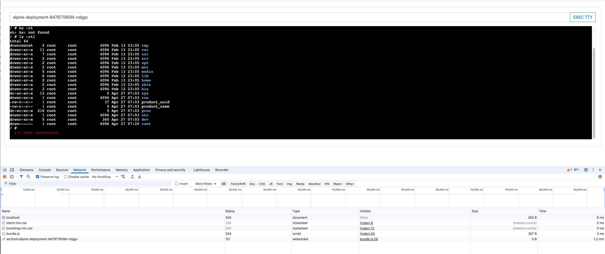

# xterm.js for K8s/OCP Pod PoC

This is a proof-of-concept (PoC) attempt to communicate directly with Kubernetes/OpenShift Websocket, proxy the requests and expose it using `xterm.js` terminal emulator.

## Requirements
- Docker
- NodeJS
- K8s environment (Kind)

## K8s Cluster
First setup a Kind cluster

```bash
./kind/setup.sh
```

## K8s Configuration

```bash
# Define namespace/project name
KUBERNETES_NAMESPACE=xtermjs

# Create namespace
kubectl create ns $KUBERNETES_NAMESPACE

# Creates service account and assigns needs permissions
kubectl apply -n $KUBERNETES_NAMESPACE -f k8s/service-account.yml

# Create test Alpine deployment
kubectl apply -n $KUBERNETES_NAMESPACE -f k8s/alpine-deployment.yml

TOKEN_NAME=$(kubectl get secrets -n $KUBERNETES_NAMESPACE | grep terminal-account-token | head -n 1 | cut -d " " -f1)
KUBERNETES_SERVICE_ACCOUNT_TOKEN=$(kubectl describe secret $TOKEN_NAME -n $KUBERNETES_NAMESPACE | grep -o -E "ey.+")

# Get list of pods
kubectl get pods -n $KUBERNETES_NAMESPACE

# Get Kubernetes API Server
KUBERNETES_HOST=$(kubectl cluster-info | grep "Kubernetes control plane" | awk -F"https://|:" '{print $2 ":" $3}')

# Append required config
cat <<EOF >> .env
KUBERNETES_HOST=$KUBERNETES_HOST
KUBERNETES_NAMESPACE=$KUBERNETES_NAMESPACE
KUBERNETES_SERVICE_ACCOUNT_TOKEN=$KUBERNETES_SERVICE_ACCOUNT_TOKEN
EOF

## Server

```bash
# Runs with node v21.7.1
node --version

# Install required dependencies
npm install

# Start PoC server - http://localhost:3000
npm run serve

```

# Access to the Terminal
# http://localhost:3000

